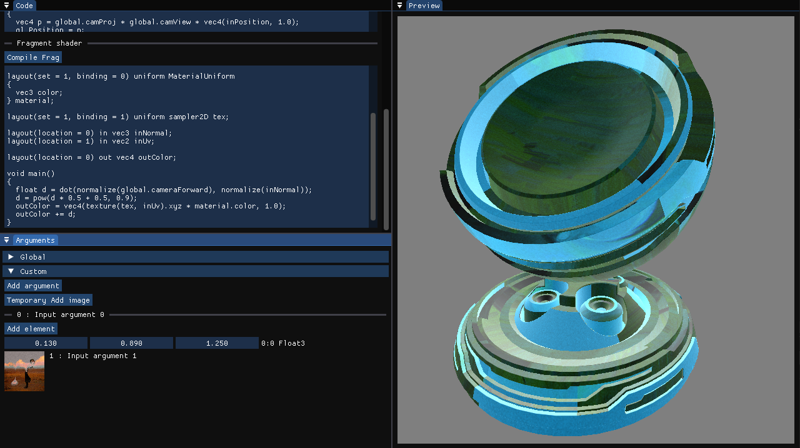

# Material sandbox
A shader editor written in C/C++ using Vulkan to allow for quick GLSL iteration.

Runs shader compilation and allows for the customization of the input set at runtime with an ImGui interface.

## Next steps:
- Image inputs
- Code <-> Arguments panel synchronization
- Renderpass editing

## Intallation
Requires the VulkanSDK to be installed for shader compilation
`git clone https://github.com/ReidYeager/MatSandbox --recursive`
