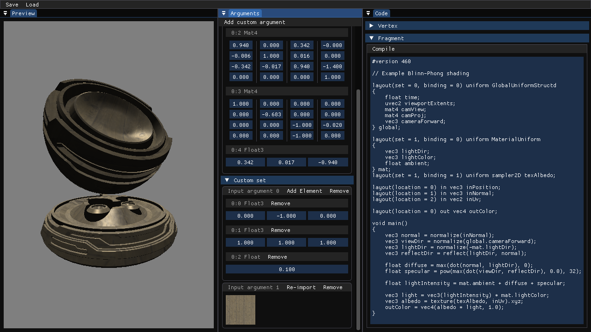

# Material sandbox
A shader editor written in C/C++ using Vulkan to allow for quick GLSL iteration.

Runs shader compilation and allows for the customization of the input set at runtime with an ImGui interface.

## Downloading
Requires the VulkanSDK to be installed for shader compilation

`git clone https://github.com/ReidYeager/MatSandbox --recursive`

## Wishlist :
- General UI overhaul
	- Filesystem interaction via a file browser
	- Preview options panel
	- (Very long term. Will likely have to move away from Imgui for some functionality)
- Synchronize code and arguments panel
	- Argument indices, names/labels
- Sample-able backgrounds
- "Lock" global values that are edited in the arguments panel
- Global-level lights
- Customizable renderpasses
	- Multiple subpasses
	- Dependency editing
	- Input arguments
- Support for more shader types
	- Compute, geometry, mesh
